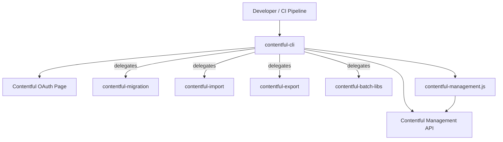

# Architecture

## Overview

`contentful-cli` is the official command-line interface for [Contentful](https://www.contentful.com). It provides subcommands for managing spaces, environments, content types, extensions, migrations, import/export, organization security checks, and the merge workflow. It is published to npm and also distributed as standalone binaries for macOS, Linux, and Windows.

## System Context

The CLI is the **user-facing entry point** for content-as-code workflows. It delegates heavy lifting to satellite packages (`contentful-migration`, `contentful-import`, `contentful-export`, `contentful-batch-libs`) and uses `contentful-management.js` (CMA.js) as the API client.

## Internal Structure

| Directory | Purpose |
|---|---|
| `bin/contentful.js` | Entry point — requires compiled `dist/lib/cli.js` |
| `lib/cli.ts` | Yargs CLI setup, top-level command registration |
| `lib/cmds/` | Top-level commands (`login`, `logout`, `init`, `space`, `merge`, `organization`, etc.) |
| `lib/cmds/<cmd>_cmds/` | Subcommands (e.g., `space_cmds/create.ts`, `organization_cmds/sec-check.ts`) |
| `lib/utils/` | Shared utilities — API clients, error handling, proxy, pagination, merge logic |
| `lib/utils/merge/` | Merge-specific utilities (changeset rendering, content type helpers) |
| `lib/core/events/` | Internal event system for space creation and logging |
| `lib/config.js` | Command authorization lists (no-auth-needed, no-space-id-needed) |
| `lib/context.js` | Context resolution — reads `.contentfulrc.json`, resolves active space, environment, token |
| `docs/` | Per-command documentation with usage examples |
| `test/unit/` | Unit tests (Jest) |
| `test/integration/` | Integration tests with talkback proxy recordings |
| `test/e2e/` | End-to-end tests against standalone binaries |
| `dist/` | Compiled output (TypeScript → CommonJS) |
| `build/` | Standalone binary output (`@yao-pkg/pkg`) |

## Data Flow

1. **Authentication**: `contentful login` opens the OAuth page in a browser, user copies CMA token back, token is stored in `~/.contentfulrc.json`.
2. **Context resolution**: Before each command, the CLI reads `.contentfulrc.json` for active space ID, environment ID, host, and management token.
3. **Command execution**: Yargs dispatches to the appropriate command handler in `lib/cmds/`. Commands use `contentful-management.js` to make API calls.
4. **Delegation**: Import, export, and migration commands delegate to their respective npm packages, passing configuration and the CMA client.
5. **Output**: Results are rendered to the terminal via `chalk`, `cli-table3`, `boxen`, and `listr` (task runner UI).

## Key Dependencies

| Dependency | Why it's here |
|---|---|
| `yargs` (~13.3.2) | CLI framework — command parsing, help generation, argument validation |
| `contentful-management` (^12.2.0) | CMA.js SDK — all API interactions ([ADR: CMA v12 migration](./docs/ADRs/2026-04-22-cma-v12-migration.md)) |
| `contentful-migration` (^5.0.0) | Migration script execution engine |
| `contentful-import` / `contentful-export` | Space import/export functionality |
| `contentful-batch-libs` (^11.0.0) | Shared batch processing utilities for import/export |
| `inquirer` (^8.2.7) | Interactive prompts (space selection, login, init) |
| `listr` | Task runner UI for multi-step operations |
| `chalk` | Terminal styling |
| `@yao-pkg/pkg` (dev) | Standalone binary compilation ([ADR: yao-pkg migration](./docs/ADRs/2026-04-10-yao-pkg-standalone-binaries.md)) |

## Configuration

| Variable / Flag | Purpose | Default |
|---|---|---|
| `~/.contentfulrc.json` | Global config — management token, active space/env, host | Created on `login` |
| `.contentfulrc.json` (local) | Per-project config — overrides global settings | None |
| `--management-token` / `--mt` | Override stored token for a single command | From config |
| `--space-id` | Override active space | From config |
| `--environment-id` | Override active environment | `master` |
| `--host` | CMA host (EU: `api.eu.contentful.com`) | `api.contentful.com` |
| `--proxy` | HTTP proxy in `user:auth@host:port` format | None |
| `http_proxy` / `https_proxy` | Environment variable proxy config | None |

## Integration Points

### Upstream (this repo consumes)

- **Contentful Management API** — all CRUD operations on spaces, environments, content types, entries, assets, extensions, organizations
- **Contentful OAuth Page** (`contentful-cli-oauth-page` repo) — browser-based token acquisition during `contentful login`

### Downstream (consumes this repo)

- **Developers** — installed globally via `npm install -g contentful-cli` or `npx contentful-cli`
- **CI/CD pipelines** — migration execution, import/export, environment management in automated workflows
- **Standalone binary users** — macOS/Linux/Windows binaries attached to GitHub releases
