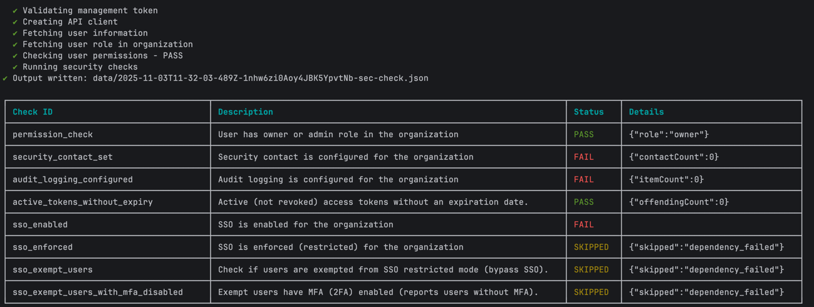

# Contentful CLI - `sec-check` command

This command runs a series of security checks on a Contentful Organization.

| Check | Description |
|-------|-------------|
| `permission_check` | Validates user has sufficient privileges (owner/admin) to perform security checks  |
| `security_contact_set` | Ensures ≥1 security contact is configured |
| `audit_logging_configured` | Confirms audit logging is enabled |
| `active_tokens_with_long_expiry` | Flags active access tokens whose expiration date is more than 1 year in the future |
| `sso_enabled` | Validates SSO is enabled |
| `sso_enforced` | Validates SSO restricted mode is on |
| `sso_exempt_users` | Flags users exempt from SSO enforcement |
| `sso_exempt_users_with_mfa_disabled` | Flags SSO-exempt users without MFA |


## Usage
```
Usage: contentful organization sec-check --organization-id <organization-id>

Options:
  -h, --help                Show help                                  [boolean]
  --organization-id, --oid  Contentful organization ID       [string] [required]
  --management-token, --mt  Contentful management API token (overrides stored
                            context token)                              [string]
  --header, -H              Pass an additional HTTP Header              [string]
  --output-file, -o         Write JSON results to a file. If used without a
                            filename, a default file
                            ./data/<timestamp>-<org-id>-sec-check.json is
                            created.                                    [string]
```

## Prerequisites
- A Contentful Management API token with org admin/owner permissions to read organization settings.


## Example

```
contentful organization sec-check --organization-id 123456789 -o
```




Outputs JSON with fields:
```
{
  "permission_check": {
    "description": "User has owner or admin role in the organization",
    "pass": true
  },
  "security_contact_set": {
    "description": "Security contact is configured for the organization",
    "pass": true,
    "data": {
      "contactCount": 1
    }
  },
  "audit_logging_configured": {
    "description": "Audit logging is configured for the organization",
    "pass": true,
    "data": {
      "itemCount": 1
    }
  },
  "active_tokens_with_long_expiry": {
    "description": "Active (not revoked) access tokens whose expiration date is more than 1 year in the future.",
    "pass": false,
    "data": {
      "offendingCount": 6
    }
  },
  "sso_enabled": {
    "description": "SSO is enabled for the organization",
    "pass": true
  },
  "sso_enforced": {
    "description": "SSO is enforced (restricted) for the organization",
    "pass": true
  },
  "sso_exempt_users": {
    "description": "Check if users are exempted from SSO restricted mode (bypass SSO).",
    "pass": false,
    "data": {
      "exemptUserIds": [
        "2qEuWkv9GLQ8ypPK96xjZk"
      ],
      "exemptCount": 1
    }
  },
  "sso_exempt_users_with_mfa_disabled": {
    "description": "Exempt users have MFA (2FA) enabled (reports users without MFA).",
    "pass": false,
    "data": {
      "mfaDisabledUsers": [
        {
          "id": "2qEuWkv9GLQ8ypPK96xjZk",
          "email": "hussam.khrais+test@foo.com"
        }
      ],
      "mfaDisabledCount": 1
    }
  }
}
```
A check with pass:false indicates action required.
